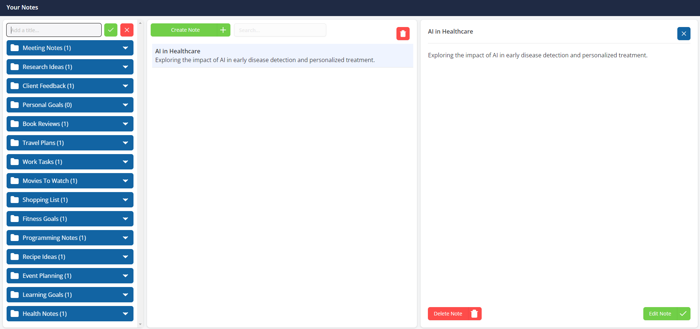

# Flex-Task App

**Flex-Task** is a task management application built with **Vite + React.js** that allows users to create, view, and delete categories. Each category contains notes that support CRUD operations (Create, Read, Update, Delete).

**NOT:** LocalStorage is used for storing categories. By default there is a json file to simulate functionality.

[Flex-Task](https://flex-task-emre.vercel.app/)

## Table of Contents

- [Features](#features)
- [Technologies Used](#technologies-used)
- [Installation](#installation)
- [Acknowledgements](#acknowledgements)
- [Usage](#usage)
- [Project Structure](#project-structure)
- [Screenshots](#screenshots)

## Features

- **Category Management:** Create, display, and delete categories.
- **Note Management:** Perform CRUD operations for notes inside each category.
- **State Management:** Managed globally using `Context API`.
- **Routing:** Supports nested routes using `react-router-dom`.
- **Unique IDs:** Notes and categories are identified using `uuidv4`.

## Technologies Used

- **Vite** – Fast frontend tooling.
- **React.js** – Library for building user interfaces.
- **TypeScript**: Language for application-scale JavaScript.
- **shadcn/ui** & **TailwindCSS** – For building a modern and responsive UI.
- **Context API** – For global state management.
- **react-router-dom** – For navigation and route management (including nested routes).
- **lucide-react** – Icon library for modern SVG icons.
- **uuidv4** – For generating unique IDs.

## Installation

1. Clone the repository:
   [Repository link](https://github.com/emrebican/flex-task)
   ```bash
   git clone <repository-url>
   cd flex-task
   ```


2. Install dependencies:

   ```bash
   npm install
   ```

3. Start the development server:

   ```bash
   npm run dev
   ```

4. Open your browser and go to:

   ```
   http://localhost:5173
   ```

   ## Acknowledgements

- [**Vite**](https://vitejs.dev/)
- [**React**](https://react.dev/)
- [**Shadcn/ui**](https://ui.shadcn.com/)
- [**Lucide**](https://lucide.dev/guide/packages/lucide-react)
- [**TailwindCss**](https://tailwindcss.com/)
- [**UuidV4**](https://www.uuidgenerator.net/version4)

## Usage

- **Categories:** Use the app to create new categories. View all categories from the main dashboard.
- **Notes:** Add notes inside a category. Edit, update, or delete notes as needed.
- **Navigation:** Navigate through different categories and notes using nested routes.

## Project Structure

```
flex-task/
├── public/              # Static assets
├── src/
│   ├── assets/          # Static assets + dummy data for list
│   ├── components/      # Application components
│     ├── category/      # Category components
│     ├── note/          # Note components
│     ├── ui/            # UI components from shadcn/ui - radix-ui
│   ├── constants/       # Variable defines for actions
│   ├── hooks/           # Custom hooks for useCategories context and useToast
│   ├── layout/          # Layout wrapper to separate header and main content
│   ├── lib/             # Utility functions
│   ├── models/          # Interfaces for states
│   ├── store/           # Context API for state management
│     ├── context/       # Providers
│     ├── reducers/      # Reducer functions
│   └── App.tsx          # App component
│   └── main.tsx         # Application entry point
├── package.json         # Project metadata and scripts
└── vite.config.ts       # Vite configuration
```

## Screenshots




